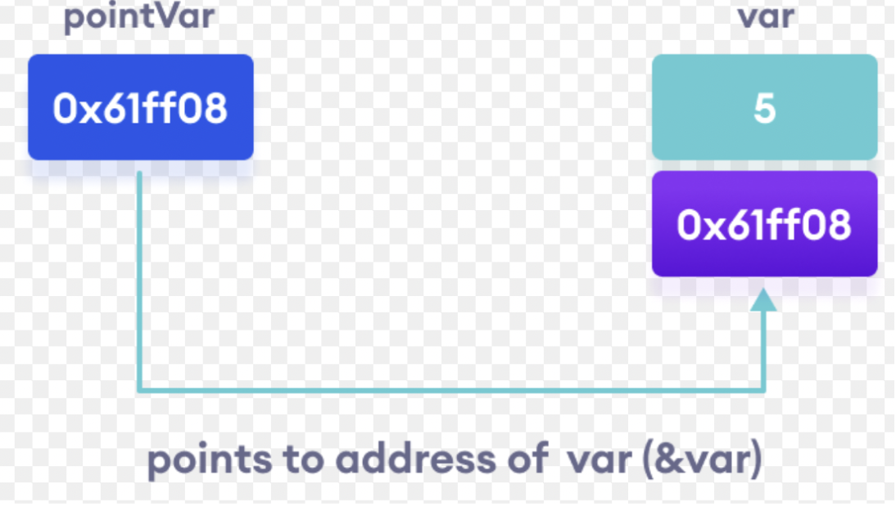
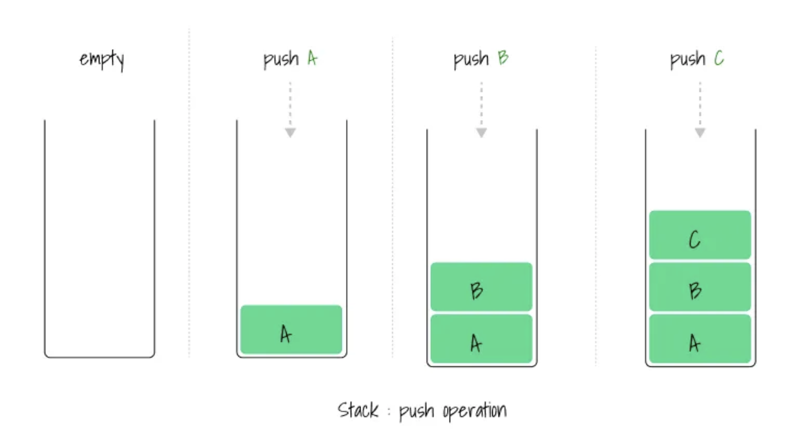
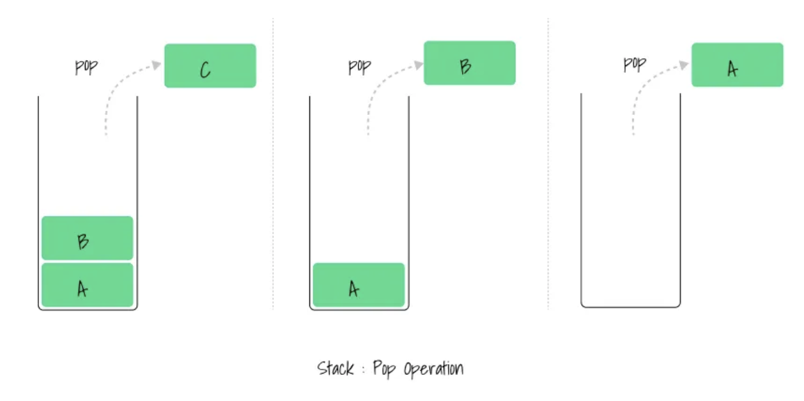
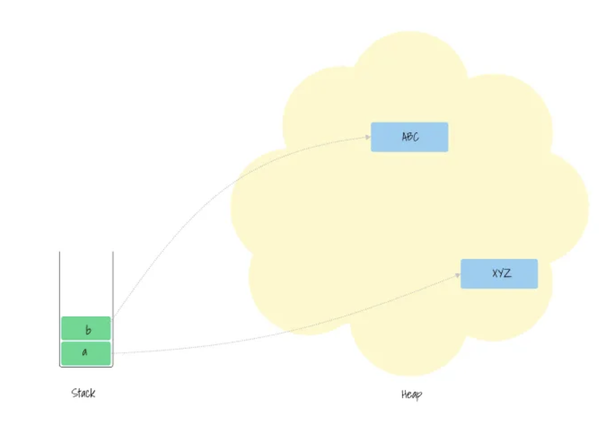

## Phân biệt Stack và Heap 

### Định nghĩa biến và con trỏ (pointer)

1.  Biến: Đại diện cho giá trị, lưu giá trị ở một vùng nhớ nào đó 
2. Con trỏ: cũng là giá trị nhưng giữ địa chỉ trỏ tới vùng nhớ mà giá trị được lưu 

Ví dụ minh hoạ:

### Stack

+ Cấu trúc dữ liệu - Last in first out (Vào sau ra trước)
+ Gồm 2 lệnh : `push` -> Thêm dữ liệu vào stack , `pop` -> Lấy dữ liệu ra

PUSH

POP

### Heap 

1. Khi dữ liệu cần thêm vào heap ( thường là kiểu dữ liệu không biết trước được kích thước, hoặc kích thước có thể tăng), `memory allocator` tìm vùng nhớ ở Heap sao cho đủ kích thước để lưu dữ liệu
2. Vùng nhớ đó sẽ đánh dấu là đã được sử dụng, trả về `pointer` 

### So sánh Stack và Heap 

| Stack       | Heap        |
| ----------- | ----------- |      
| Tạo vùng nhớ và đọc giá trị nhanh      | Runtime Performance Cost       |      
| Size cố định   | Kích thước có thể tăng        |    
| Rust Primitives   | Collections ( HashMap, Vec , String, ..)        |
