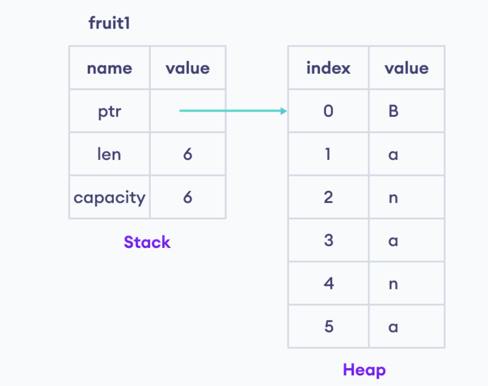
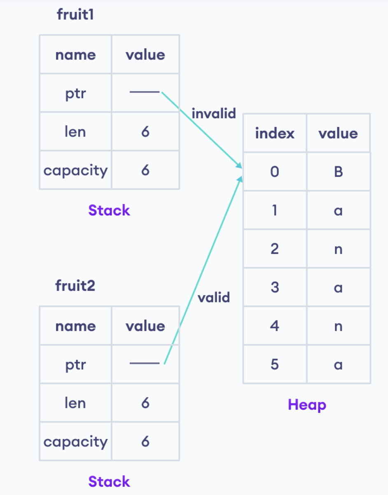

## Rust Ownership (Quyền sở hữu)
+ Đây là cơ chế quản lý bộ nhớ chương trình của Rust 
+ Gồm 3 quy tắc nhằm đảm bảo an toàn bộ nhớ chương trình


### Phạm vi biến trong Rust 
+ Phạm vi ở đây có nghĩa là 1 block code được định nghĩa trong `{}`
+ Biến định nghĩa trong 1 phạm vi là hợp lệ, ngoài phạm vi `{}` thì biến không hợp lệ
( vùng nhớ lưu giá trị của biến đó đã tự động xoá)

Ví dụ: 

```
{
    let name = String::from("Hello");

}
// Biến `name` không tồn tại -> vì nằm ngoài phạm vi của biến name 
```


### Các quy tắc Ownership
1. Mỗi giá trị chỉ có 1 owner
2. Chỉ có 1 owner tại 1 thời điểm 
3. Khi owner không còn nằm trong phạm vi thì giá trị sẽ bị `dropped` (xoá)


### Ví dụ 1

```rust
    // `fruit1` đang sở hữu 1 giá trị có kiểu String 
    // Quy tắc 1.
    let fruit1 = String::from("Banana");
    
    // Tính sở hữu (ownerhship) chuyển qua từ `fruit1` sang `fruit2`
    // chỉ có 1 owner tại 1 thời điểm 
    // Quy tắc 2 
    let fruit2 = fruit1;
    
    // không thể in ra `fruit1` vì `fruit1` đã mất quyền sở hữu
    // giá trị của `fruit1` bị xoá 
    // Quy tắc 3
    println!("fruit1 = {}", fruit1);
    
    // In giá trị của `fruit2`
    println!("fruit2 = {}", fruit2);

```

Giải thích:

1. Biểu diễn vùng nhớ của biến `fruit1` lưu trữ giá trị `Banana` 


+ Dữ liệu `String` được lưu trữ cả ở `Stack` và `Heap`
+ `String` giữ `con trỏ` đến vùng nhớ chứa nội dung của `String`, `len` và `capacity` trên `Stack`. Phần `Heap` chứa nội dung của chuỗi

2. Khi gán giá trị từ `fruit1` sang `fruit2`. Thì biễu diễn vùng nhớ như sau:



+ `Rust Compiler` sẽ `drop` biến `fruit1` và chuyển giá trị sang `fruit2`
+ Suy ra -> không thể có 2 biến cùng trỏ tới 1 dữ liệu 


### Ví dụ 2

```rust
    let x = 11;   
    // copy giá trị từ x sang y
    // ownernship ko áp dụng trong trường hợp này 
    let y = x;
    println!("x = {}, y = {}", x, y);
```

+ Kiểu dữ liệu nguyên thuỷ của Rust (Rust Primitive Types) sẽ không theo quy tắc ownernship 
+ Primitive types: `a known size at compile time` -> lưu ở `Stack` -> copy sẽ nhanh hơn 

### Ownership ở Hàm 


Ví dụ:
```rust
    fn main() {
        let fruit = String::from("Apple"); // biến `fruit` đang ở scope hàm main
        
        // tính sở hữu của biến `fruit` được chuyển sang biến địa phương (local)
        print_fruit(fruit);
        
        // `fruit` bị dropped
        // Lỗi khi sử dụng lại biến `fruit`
        println!("fruit = {}", fruit);
    }

    fn print_fruit(str: String) {   // biến `str`` đang ở scope hàm `print_fruit`
        println!("str = {}", str);
    }   
    // str goes out of scope -> xoá -> giải phóng vùng nhớ của `str`
```